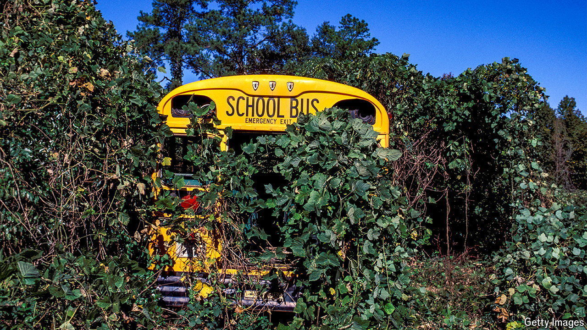

###### Sleeper species

# Climate change could reawaken harmful invasive plants 

##### The sooner they can be weeded out, the better 

 

> Aug 14th 2024 

THE MISSION is simple. Arrive on foreign soil, blend in and wait. Then, when the time is right, emerge from the shadows and take over. This procedure, familiar from  as the preserve of sleeper agents, is also the  of certain invasive plant species.

