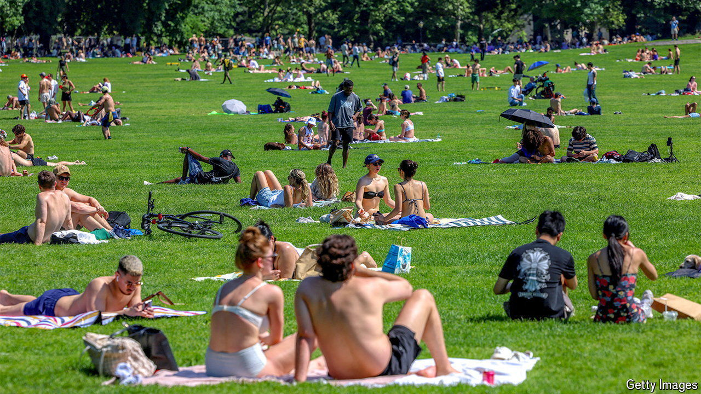

###### Rays of hope

# Exposure to the sun’s UV radiation may be good for you 

##### For now, though, keep the sun cream handy 

 

> Aug 12th 2024 

BASKING IN THE sun has been considered a health hazard for at least four decades. The main risk comes from ultraviolet (UV) light, which the Sun emits alongside visible radiation. This can increase the chances of skin cancer—the number of diagnoses of which are rising—as well as bringing on premature ageing and leading to wrinkles. As a result, most developed countries recommend  protect their skin in the heat of the day with sun cream, especially in the summer months.

