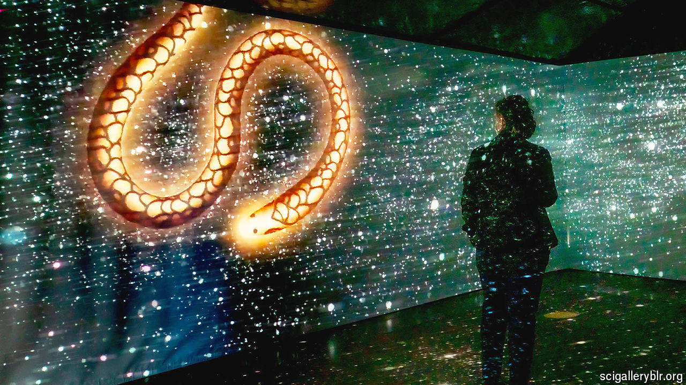

###### Carbon-based artforms

# Why a new art gallery in Bangalore is important for Indian science 

##### It aims to make research and tinkering more accessible to the public 

 

> Aug 14th 2024 

IN A WORK titled “Allotropy of Mine” Daniela Brill Estrada, an artist from Colombia, confronts viewers with her body’s carbon content. A set of Ikea shelves displays jars, big and tiny, each filled with charcoal powder and labelled with the body part it represents: “Brain: 150g”, “Intestinal flora: 210g”, “Fats: 2.1kg”. It is a powerful way of visualising human biochemistry. 

