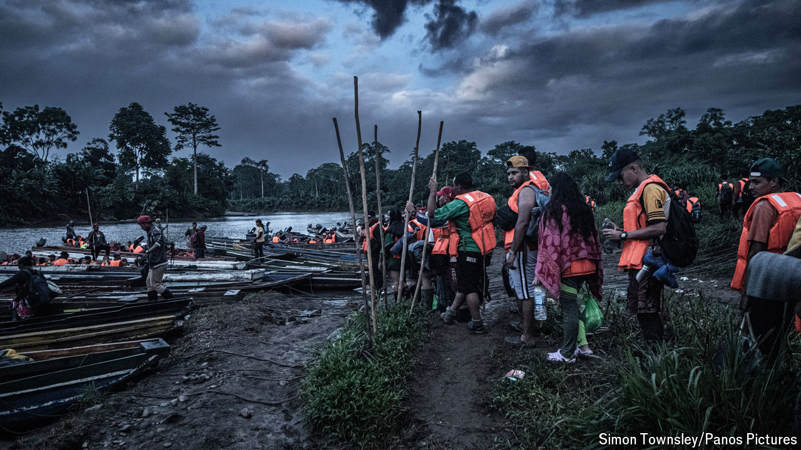

###### Law of the jungle

# A bold plan to close the deadly Darién Gap unravels 

##### America and Panama struggle to control surging migration 

 

> Aug 15th 2024 

At a migrant shelter in the thick jungle of Colombia’s Darién region a restaurant advertises fried fish, pork chops and 5G internet. A sign in cheerful bubble letters points the way to the border with Panama. Yet just a 30-minute walk along the muddy, steep path from the restaurant, a razor-wire fence stretches between the trees. “All I can say is that this route is closed,” says an agent from Senafront, Panama’s border force, an automatic rifle hanging from his shoulder. “As for 500 metres that way, or a kilometre that way, I don’t know what to tell you.”

