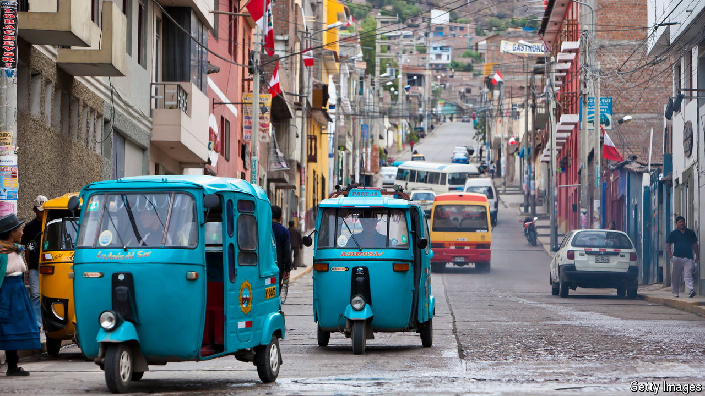

###### The lawless roads

# Peru’s crazy drivers offer a data deluge for self-driving cars 

##### A startup sees value in the chaos of the country’s streets 

 

> Aug 15th 2024 

Tuk-tuks with precarious cargo zoom down highways. Street vendors, angry protesters and careless llamas weave through vehicles. Buses literally overflow with passengers. Welcome to Peru, home to some of the world’s most chaotic streets. According to Compare the Market, a car insurance aggregator, Peruvian drivers are the world’s worst after Thailand’s. The ranking considers factors such as deaths caused by car accidents and time wasted in traffic. Typical road journeys in the capital, Lima, take nearly twice as long as they need to as a result of congestion. Police prefer asking for bribes to enforcing rules. 

