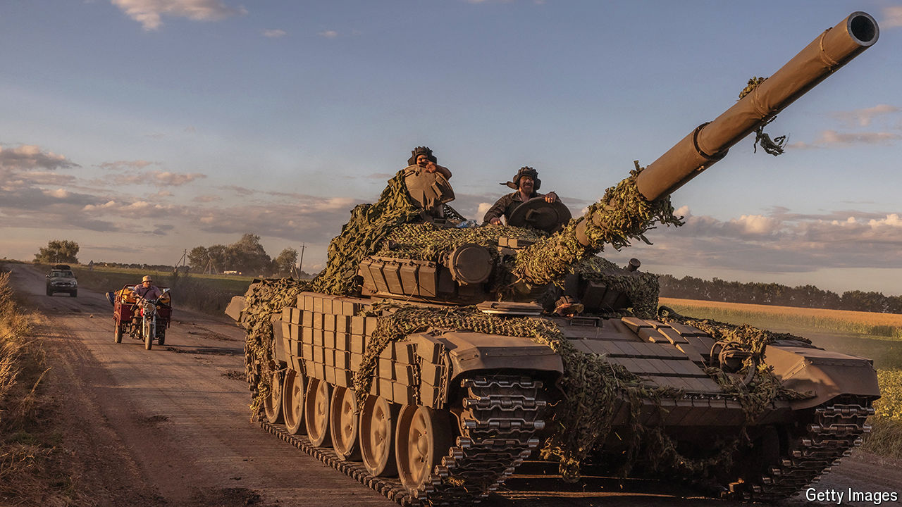

###### The world this week

# Politics 

#####  

 

> Aug 15th 2024 

s deep into  territory caught the Kremlin by surprise. Ukraine’s most senior commander claimed his forces controlled 1,000 square kilometres (386 square miles) of Russia’s Kursk region. More than 200,000 Russian civilians were evacuated and a state of emergency was declared in a second Russian province, Belgorod, as the fighting spread there. Volodymyr Zelensky said the operation was justified as the region was a launching point for Russian attacks on his country. Vladimir Putin pledged to repel the Ukrainian advance.

