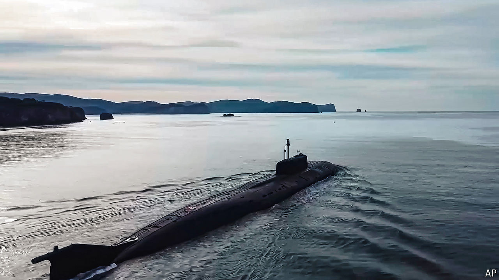

###### On the eve of escalation

# America prepares for a new nuclear-arms race 

##### Its build-up could start as early as 2026 

 

> Aug 12th 2024 

IN THE PENTAGON these days, those who plan for Doomsday have a new nightmare: no longer yesteryear’s dread of one big nuclear foe, but of several at the same time. What if, asks one official,  attacked a , drawing America in to defend Europe; then China seized on America’s distraction to invade ; and then North Korea decided to attack the south? Three wars; three sets of friends and allies; three unpredictable nuclear crises. Could America handle them all?

