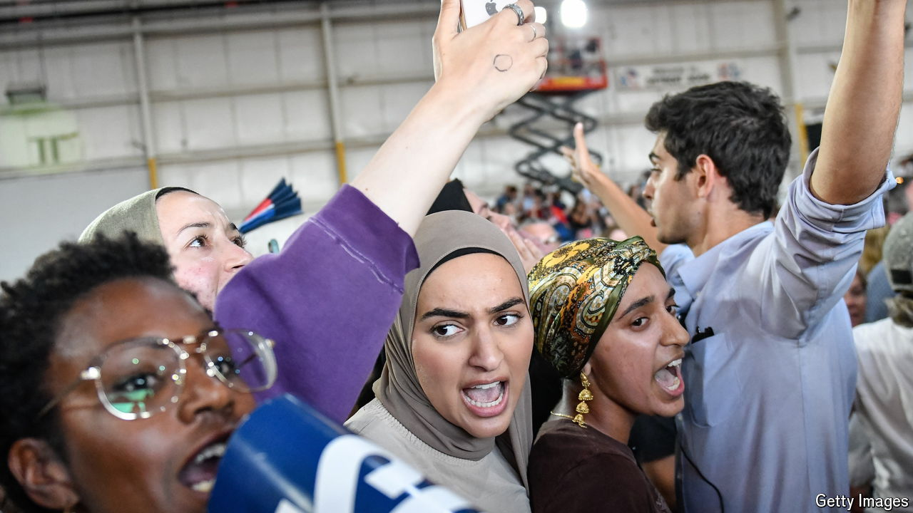

###### The Gaza question

# Can Kamala Harris win Michigan without Arab-American voters? 

##### The Democratic nominee will have tricky territory to navigate at next week’s party convention 

 

> Aug 13th 2024 

Kamala Harris’s first encounter with pro-Palestinian protesters since  unfolded at a campaign rally in a Michigan suburb on August 7th. As Ms Harris spoke to thousands of buoyant supporters, the dissenters disrupted the party vibe: “Kamala, Kamala, you can’t hide! We won’t vote for genocide!” Ms Harris acknowledged their right to speak, but as they carried on, she lost patience: “You know what? If you want Donald Trump to win, then say that. Otherwise, I’m speaking.”

