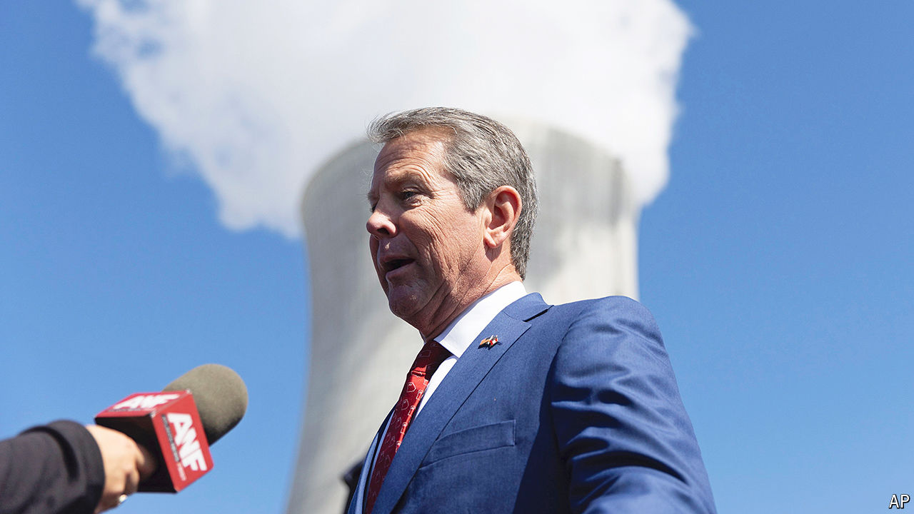

###### Trump v Kemp

# Donald Trump plays with fire in Atlanta 

##### Going after Georgia’s popular Republican governor will do him no good in the state 

 

> Aug 12th 2024 

Among many  Donald Trump has made since  swooped into the presidential race, one of the strangest came at a rally in Atlanta on August 3rd. Mr Trump devoted 11 minutes of his speech to insulting Brian Kemp, Georgia’s Republican governor. He reprimanded “little Brian” for being “disloyal” by refusing to overturn Georgia’s election results in 2020. He said that under Mr Kemp the state had “become a laughing-stock” and Atlanta a “killing field”, suggested the governor was behind his criminal prosecution in Fulton County and accused him of “doing everything possible” to make Republicans lose in November.

