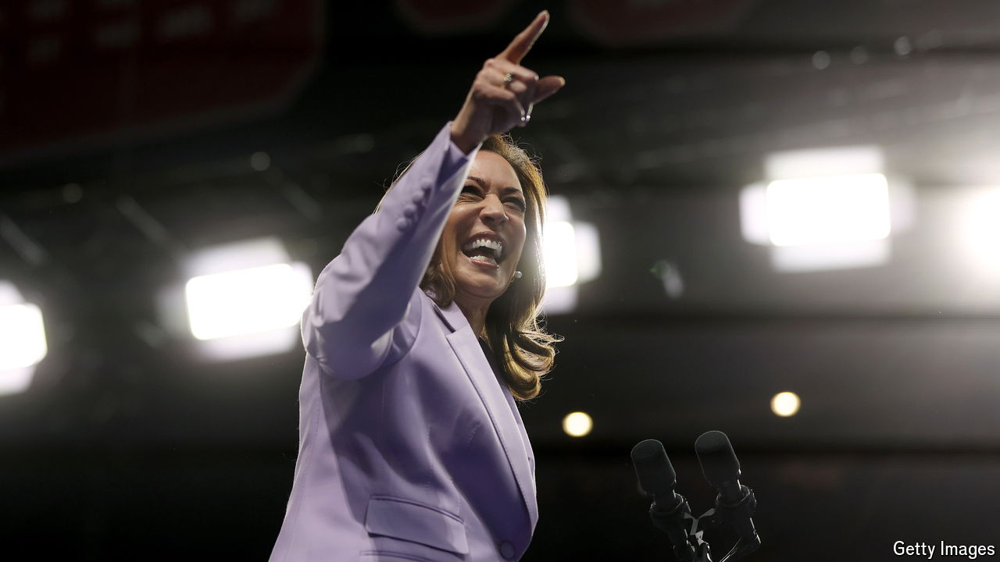

###### Too close to call

# Our new forecast for America’s presidential election 

##### Why the polls don’t tell the whole story 

 

> Aug 15th 2024 

With the benefit of hindsight, it is easy to paint Kamala Harris’s polling surge as inevitable. Americans consistently told pollsters they were dissatisfied with their presidential nominees. But Ms Harris has far . She has transformed her personal ratings and enthused the Democratic base. She leads Donald Trump nationwide by three percentage points and has overtaken him in the most recent polling of most swing states. , launched this week, shows that on July 21st, the day he withdrew, Joe Biden had a 24% chance of re-election. Now, Ms Harris has a 52% chance of winning in November—in effect, it’s a toss-up.

