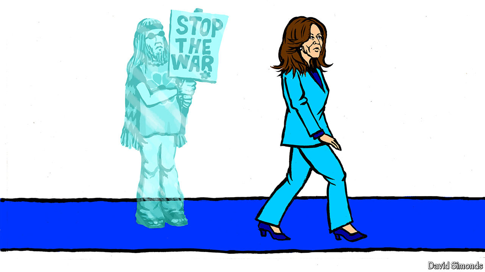

###### Lexington

# Why the 2024 Chicago convention is not the 1968 convention 

##### And the war in Gaza is not Kamala Harris’s Vietnam 

 

> Aug 15th 2024 

Democrats plan to convene in Chicago next week to celebrate as their presidential candidate a sitting vice-president who did not win a single primary vote. The candidate, a former senator, has a good record on civil rights but is tied to the White House’s support for an unpopular war. Kamala Harris may be no Hubert Humphrey, but the parallels with the Democrats’ calamitous Chicago convention of 1968 have sharpened since she replaced President Joe Biden at the top of the ticket. Party insiders ordained her, as they did Humphrey to replace Lyndon Johnson, and like Humphrey she has yet to distance herself from the president’s handling of a war that has infuriated her party’s left. 

