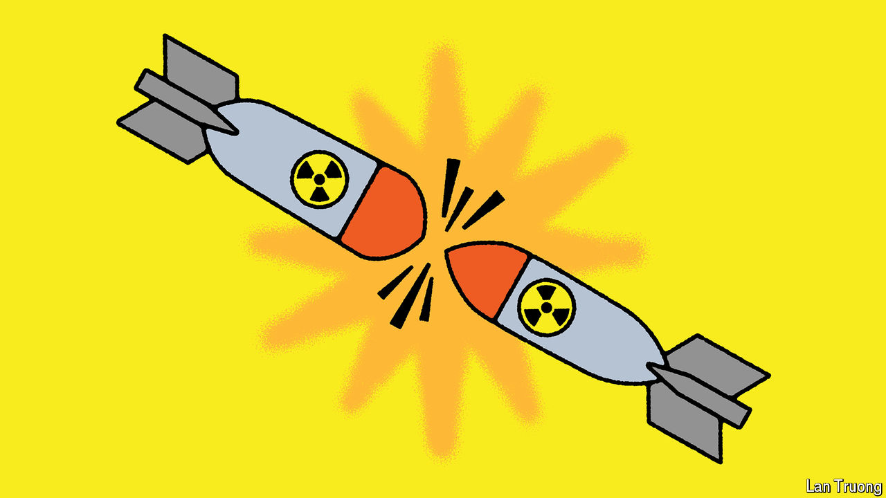

###### Banyan

# If a China and America war went nuclear, who would win? 

##### After 45 days of conventional fighting nukes would be tempting, wargamers suggest 

 

> Aug 22nd 2024 

IT IS BAD enough to contemplate a war in Asia. It is grimmer still to think through a nuclear one. But somebody has to. And so Andrew Metrick, Philip Sheers and Stacie Pettyjohn, all of the Centre for a New American Security (CNAS), a think-tank in Washington, recently gathered a group of experts to play a tabletop exercise—a type of wargame—to explore how a Sino-American nuclear war could break out. The results were not encouraging. 

