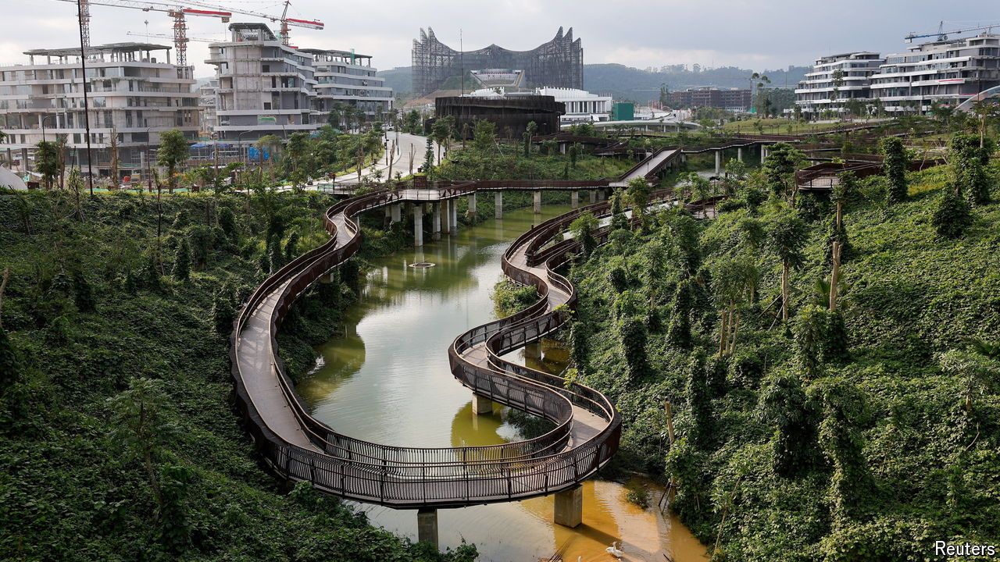

###### New city, new start?

# Indonesia’s new capital is built on vanity 

##### President Jokowi doesn’t seem to be in any mood to leave politics behind 

 

> Aug 19th 2024 

THE LEGACY of Joko Widodo (or Jokowi) was meant to be graft-free politics and an infrastructure revolution in Indonesia. On the face of it, the outgoing president has partially succeeded on the latter. During his , Jokowi’s government has overseen around 200 projects. The grandest was officially opened on August 17th, when Nusantara, an entirely new capital city carved out of the jungles of Borneo, hosted festivities to mark Indonesia’s 79th independence day. The ceremony highlighted two uncomfortable questions. One is whether Nusantara is an infrastructure leap too far: a giant vanity project doomed to fail. The other is whether Jokowi will really quit politics when his term ends in October and he is supposed to hand over power to Prabowo Subianto.

