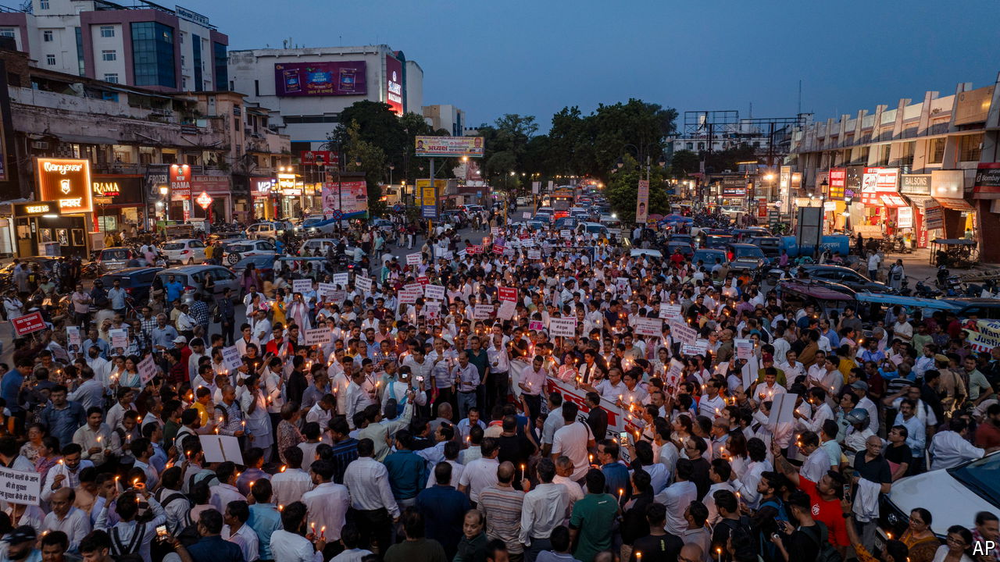

###### India’s women problem

# The rape and murder of a doctor in India is fuelling outrage 

##### But public protests about violence against women have not achieved much 

 

> Aug 22nd 2024 

THERE WERE nearly 32,000 rapes reported in India in 2022, the latest year for which data are publicly available, according to the national crime records bureau. That number hugely understates how common sexual violence is in the country. Most incidents are never reported. Those that are rarely make the news. 

