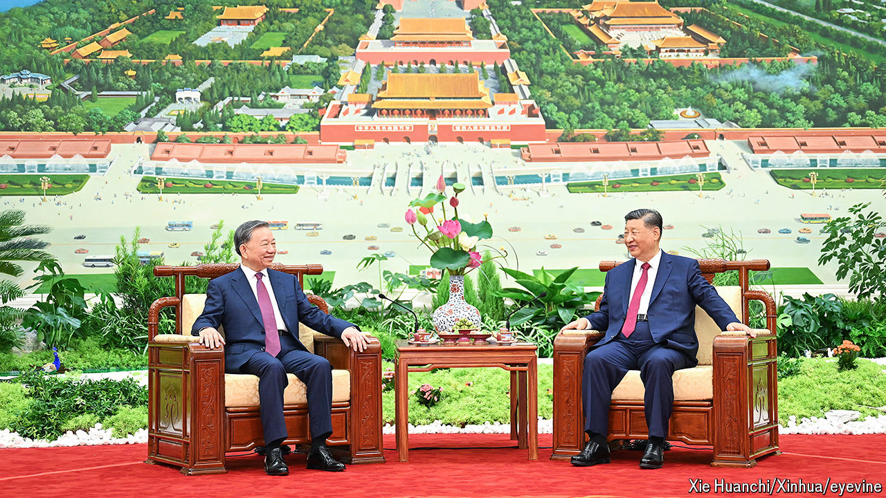

###### A succession battle in Hanoi

# Vietnam’s new ruler: hardman, capitalist, hedonist 

##### To Lam, the Communist Party’s new leader, has just met Xi Jinping. America is next 

 

> Aug 21st 2024 

What should you make of To Lam, the enigmatic new leader of , who has emerged victorious from a savage power struggle over the past year? On his first trip abroad Mr Lam (pictured, left) met his Chinese counterpart, , on August 19th. The two signed 14 documents on everything from Communist Party schools to crocodile exports. Mr Lam reaffirmed the importance of Vietnam’s biggest trading partner. Next month he will head to America. It is a sign that he intends to continue Vietnam’s “bamboo diplomacy”, . 

