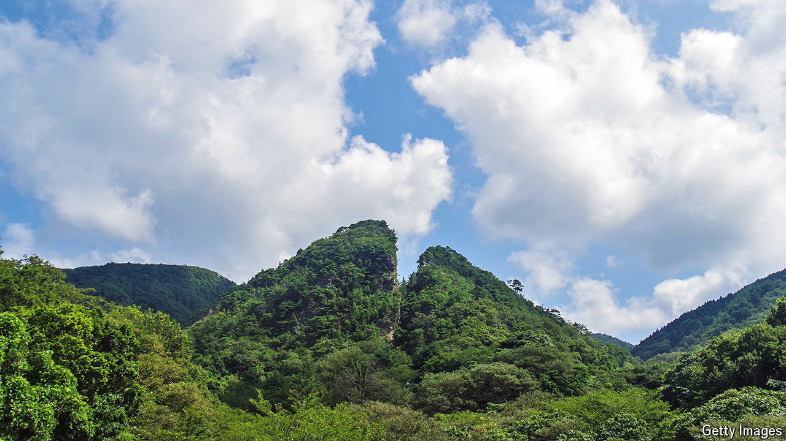

###### Mining for memories

# What a Japanese gold mine says about its approach to history 

##### The site, recently declared a World Heritage site, is more contentious than it seems 

 

> Aug 22nd 2024 

In late July the mood was celebratory at Aikawa, a town on Sado Island off Japan’s western coast. Hundreds of people cheered as they witnessed, via a live stream, the moment a gold mine in the town was registered as a UNESCO World Heritage site. “The islanders’ dream has finally come true,” said Watanabe Ryugo, the mayor. The moment also hinted at the possible thawing of diplomatic relations between Japan and South Korea. 

