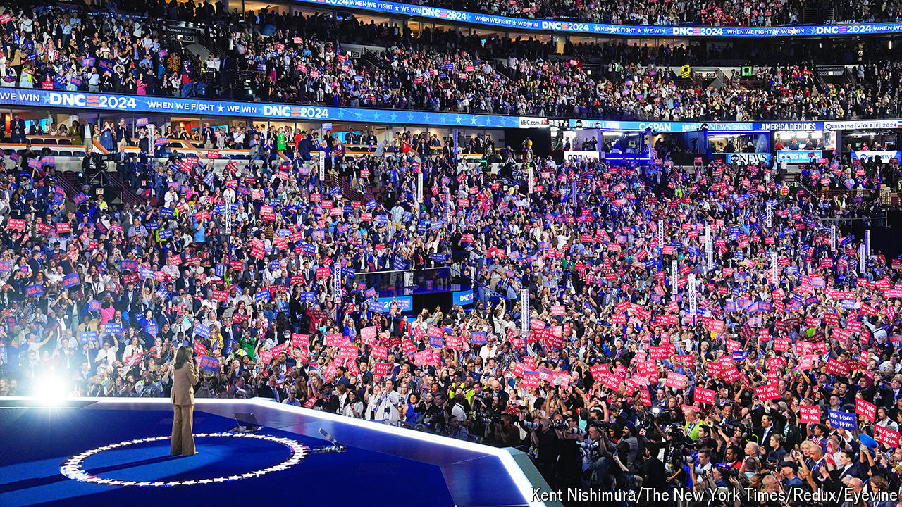

###### Woolly warrior

# Kamala Harris has revealed only the vaguest of policy platforms 

##### Her record suggests she would be a pragmatist 

 

> Aug 22nd 2024 

SCARCELY A MONTH ago, Democrats were awaiting their convention in Chicago as one might a four-day root canal. Despite losing the confidence of his party after a disastrous debate performance, the 81-year-old president, Joe Biden, was due to formalise his seemingly doomed candidacy—and perhaps drag many other Democrats down with him. But then, on July 21st, despair gave way to ecstasy, as Mr Biden dropped out and endorsed Kamala Harris, his vice-president. She became the de facto nominee within 24 hours. The dreaded ordeal was suddenly transformed into a raucous coronation.

