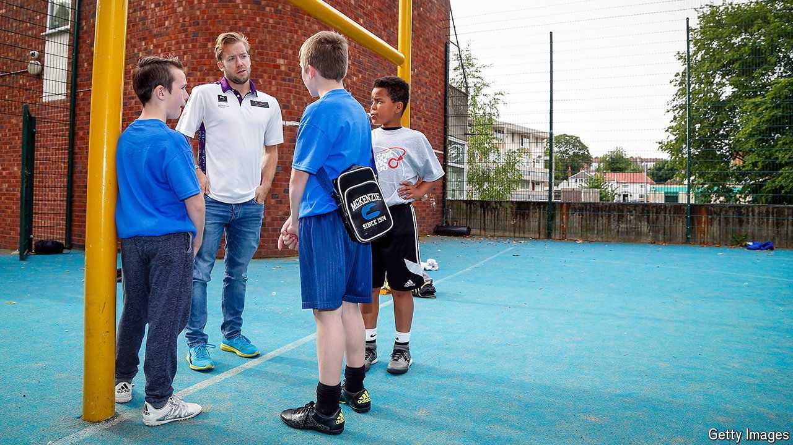

###### A place to be

# Youth clubs in Britain have been vanishing 

##### Their impact is hard to measure, but can be profound 

 

> Aug 22nd 2024 

Sometimes the small things make a big difference. Andy Hall, a youth worker from Shropshire, a rural county in England, describes a boy who had been struggling at school. No one had thought to check if his eyes had been tested until he visited a local youth club. A new pair of glasses meant he could see the board: “simple as that”. Mr Hall reckons they changed the boy’s life. 

