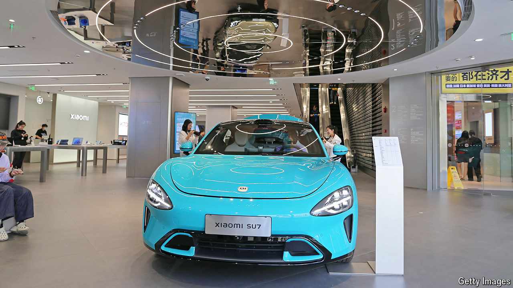

###### Tech on wheels

# Apple can’t do cars. Meet the Chinese tech giants that can 

##### Baidu, Huawei and Xiaomi have built thriving auto businesses 

 

> Aug 21st 2024 

As he screeches around corners at wildly unsafe speeds, one of the designers of the Jidu Robocar 07 calmly talks your correspondent through how the electric vehicle (EV) works. An alluring feature is its entertainment system—on which he is competing in a race-car game (thankfully, the actual car is stationary). Many of the EV’s features are controlled by voice command and there are almost no buttons or knobs. It has , a sporty design and, its maker claims, can travel 900km on a single charge that takes 12 minutes. When it goes on sale in early September it is expected to cost just 220,000 yuan ($30,850). “It’s the future of driving,” the designer says, right as he smashes his virtual race car into a railing.

