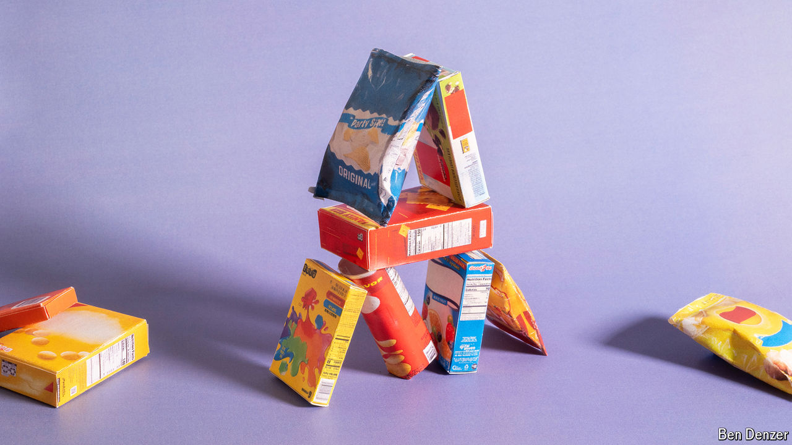

###### Appetite for change

# Can big food adapt to healthier diets? 

##### It must contend with weight-loss drugs and concerns about processed foods 

 

> Aug 18th 2024 

Big food, it seems, has a sweet tooth. On August 14th , a packaged-food giant best known for its , announced it would gobble up Kellanova, maker of Pringles and Pop-Tarts, for $36bn. It is not the only company betting big on calorific goodies. Last November Smucker’s, a purveyor of jams and peanut butters, completed its $6bn acquisition of Hostess Brands, maker of Ho Hos and Twinkies.

