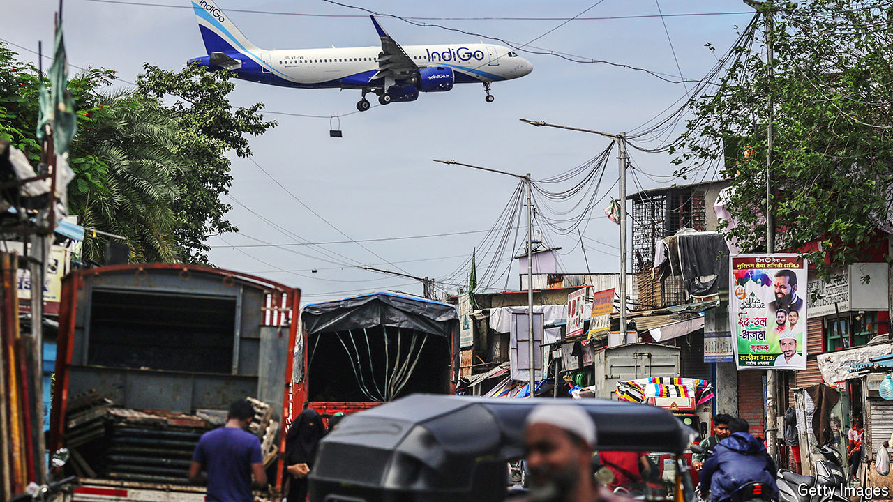

###### Blue-sky thinking

# India’s largest airline is flying high 

##### IndiGo has conquered its home market. Its ambitions are rising 

 

> Aug 22nd 2024 

To become a millionaire, start with a billion dollars and launch an airline. Usually attributed to Richard Branson, a British entrepreneur, the line gets at the truth that the aviation business is capital-hungry and failure-prone. Still, that did not deter Rahul Bhatia, a travel agent, and Rakesh Gangwal, a former airline chief. They started as mere millionaires, and today are among the richest 500 people in the world, with a combined net worth of $13.3bn, according to , a compiler of lists.

