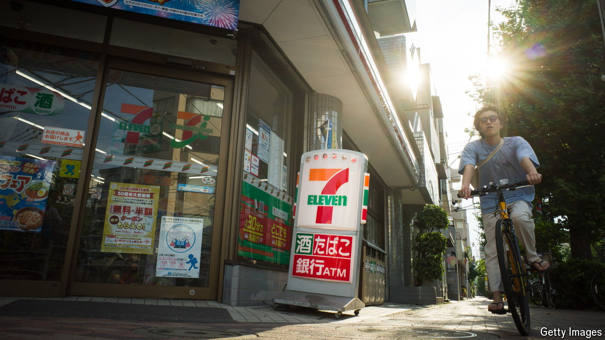

###### Konbini combination

# What a takeover offer for 7-Eleven says about business in Japan 

##### Its merger with a Canadian firm would create a convenience-store goliath 

 

> Aug 22nd 2024 

The convenience store, or , is an institution of modern Japanese life. Open at all hours, it offers customers tasty food and household essentials, as well as the ability to pay bills and send parcels. The industry leader, 7-Eleven, perfected new products, such as takeaway , or rice balls, and eventually took over the American chain from which it sprang. But if Alimentation Couche-Tard (ACT), a Canadian retailer that operates the Circle K chain of shops, has its way, 7-Eleven will no longer be Japanese. 

