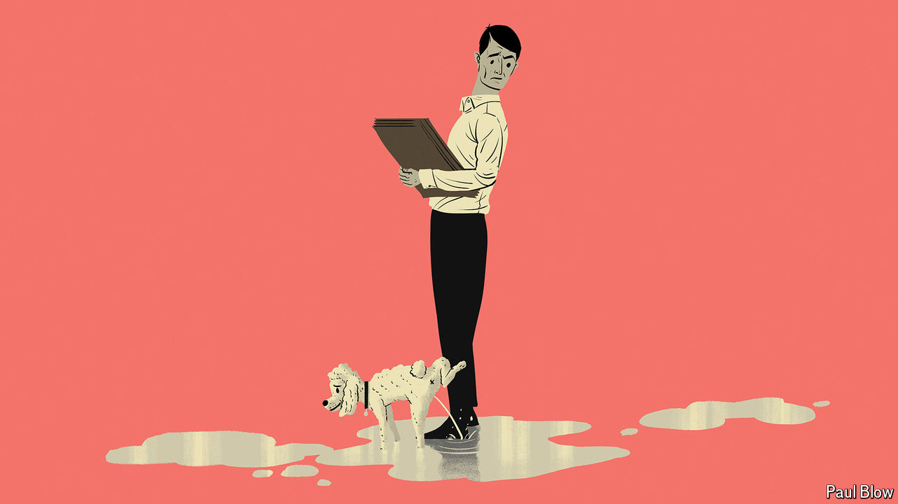

###### Bartleby

# What to do about pets in the office 

##### Dogs can bring both joy and chaos 

 

> Aug 22nd 2024 

TheoDORE Roosevelt’s bull terrier once chased the French ambassador up a tree. Commander, President Joe Biden’s German shepherd, had to be rusticated after repeatedly biting Secret Service officers. Sir Gavin Williamson, a British politician, refused to remove a tarantula he kept in a glass tank from the office. He defended the presence of Cronus by insisting the “clean, ruthless killer” was “part of the team”.

