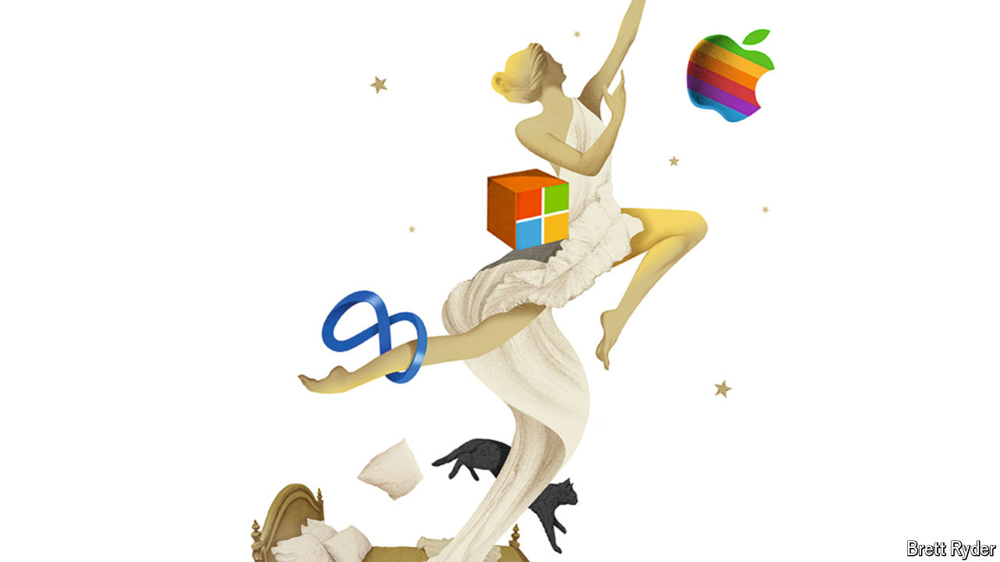

###### Schumpeter

# Why America’s tech giants have got bigger and stronger 

##### Whatever happened to creative destruction? 

 

> Aug 22nd 2024 

When your columnist first started writing Schumpeter in early 2019, he had a romantic idea of travelling the world and sending “postcards” back from faraway places that chronicled trends in business, big and small. In his first few weeks, he reported from China, where a company was using automation to make fancy white shirts; Germany, where forest-dwellers were protesting against a coal mine; and Japan, where a female activist was making a ninja-like assault on corporate governance. All fun, but small-bore stuff. Readers, his editors advised him, turn to this column not for its generous travel budget but for its take on the main business stories of the day. So he pivoted, adopting what he called the Linda Evangelista approach. From then on, he declared, he would not get out of bed for companies worth less than $100bn.

