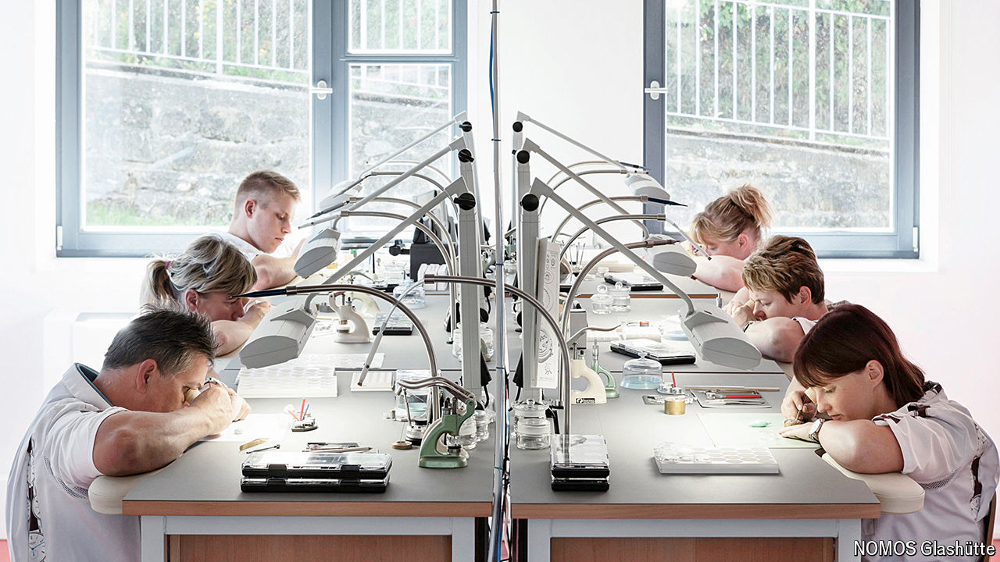

###### Changing times

# Why Germany’s watchmakers are worried about the AfD 

##### The far-right party threatens the industry’s brand 

 

> Aug 22nd 2024 

Close to the Czech border, south of Dresden in the German state of Saxony, lies Glashütte, a picturesque town of 6,700 inhabitants. As the German Watch Museum, its main visitor attraction, suggests, the town is the centre of the country’s high-end watchmaking industry. In 1845, after years of apprenticeship with makers of fine watches in France and Switzerland, Ferdinand Adolph Lange opened a workshop in Glashütte with a loan from the Saxon authorities, founding what would go on to become A. Lange &amp; Söhne, one of the world’s priciest watch brands. Today the firm, now owned by Richemont, a Swiss luxury giant, is one of the nine high-end horologists that manufacture watches in the town.

