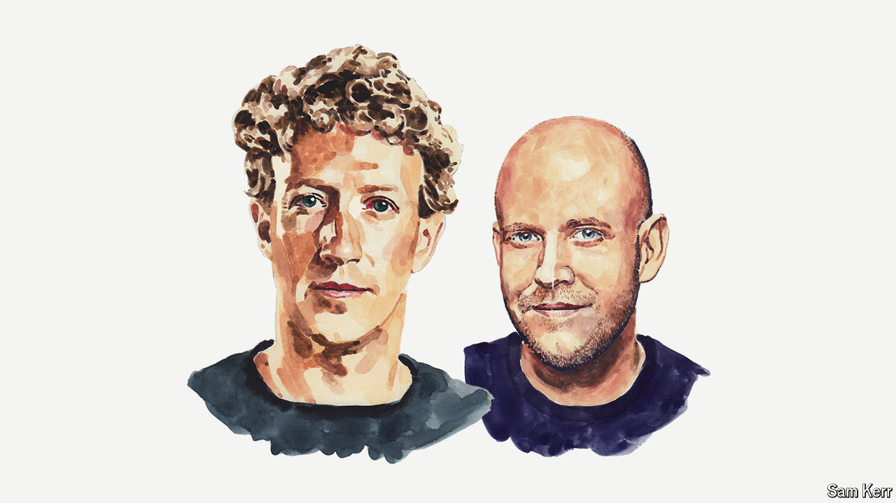

###### Artificial intelligence

# Mark Zuckerberg and Daniel Ek on why Europe should embrace open-source AI 

##### It risks falling behind because of incoherent and complex regulation, say the two tech CEOs 

 

> Aug 21st 2024 

THIS IS AN important moment in technology. Artificial intelligence (AI) has the potential to transform the world—increasing human productivity, accelerating scientific progress and adding trillions of dollars to the global economy.

