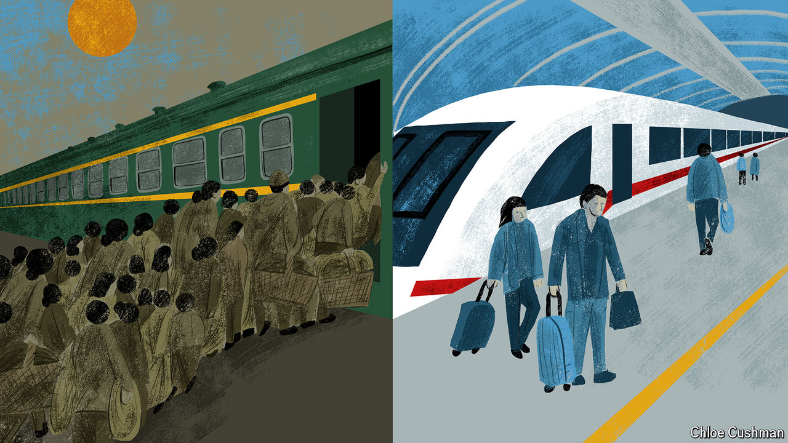

###### Chaguan

# In China’s “median city” people are surprisingly risk-averse 

##### Our columnist travels there to ask ordinary people two mega-questions 

 

> Aug 22nd 2024 

OVER RECENT decades, individual Chinese dreams reshaped the world. The largest manufacturing power on Earth emerged, in part, because hundreds of millions of rural men and women left behind families and villages to toil in coastal boomtowns. Behind dry graphs showing steep growth rates lurked stories of the human heart. Generations raised amid Maoist conformity reinvented themselves as entrepreneurs and risk-takers.

