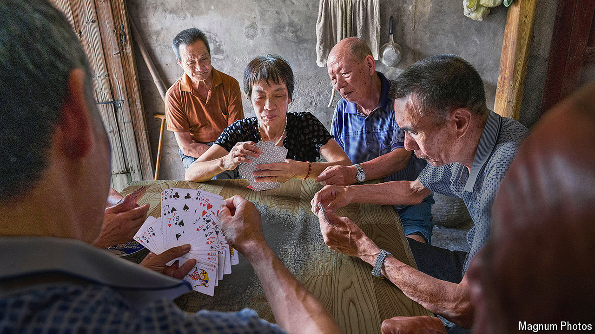

###### Tossing eggs at a national pastime

# Millions of Chinese people play guandan. Is that good or bad? 

##### The Communist Party is torn on the merits of the popular card game 

 

> Aug 22nd 2024 

In America businessmen learn to play golf in order to fit in and foster relationships. In China they learn , a card game that has become a staple of business meetings and banquets. Millions of Chinese people enjoy it. “Eating without playing doesn’t count as a meal,” says one executive. , which translates as “egg tossing” or “bomb tossing”, involves four people in teams of two. Players try to shed their cards by forming various combinations. The game can last for hours and usually involves a lot of chit-chat.

