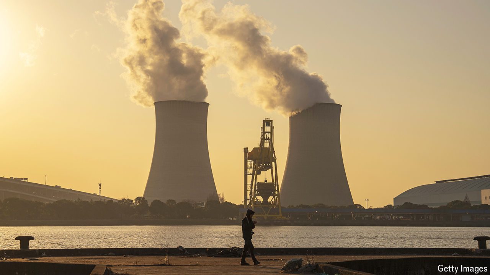

###### The other gas problem

# Time for China to get serious about its methane emissions 

##### Officials mull a future of less coal and fewer cows—and don’t like it 

 

> Aug 22nd 2024 

CHINA IS OFTEN criticised for its emissions of carbon dioxide, which dwarf those of other countries. By way of defence, Chinese leaders can at least point to their official goal of having those emissions peak by 2030. But China is also the world’s biggest emitter of methane, another greenhouse gas. It produces about 14% of global emissions each year. When it comes to methane, Chinese leaders have less to say in their defence. They are just starting to grapple with the problem.

