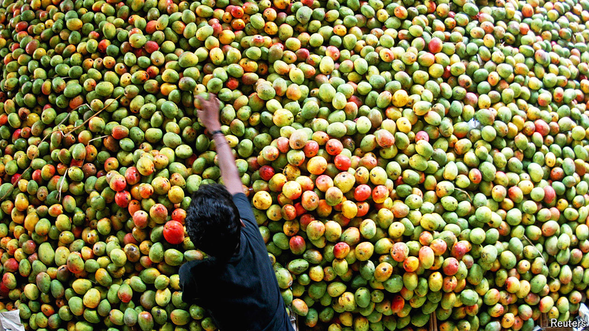

###### World in a dish

# In praise of mangoes 

##### South Asia’s mangoes deserve a wider audience 

 

> Aug 22nd 2024 

“Hindustan is a country of few charms,” observed Zahiruddin Muhammad Babur, after conquering India in the 16th century. The founder of the Mughal empire was unimpressed by the handicrafts, horses, markets, people—and especially the fruit. He complained constantly about the lack of decent melons. But even grumpy Babur could not deny the pleasures of mangoes, which “when good, are very good”. The mango, he concluded, is “the best fruit of Hindustan”. 

