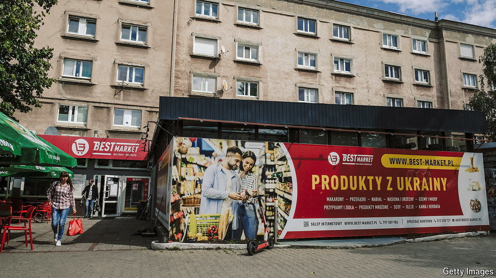

###### Turning round

# After decades of decline, Poland’s population seems to be increasing 

##### Immigration and the war are the reasons 

 

> Aug 22nd 2024 

Ageing, emigrating, shrinking. Thus the gloomy headlines about Poland’s population for decades. According to Eurostat, the EU’s statistical agency, its population is 36.6m, down 1.9m from its peak in 1998. Last year 272,451 babies were born, the lowest number in modern Polish history. In 2023 it was calculated that Polish women on average have 1.16 babies each, one of the lowest fertility rates in the world, despite years of attempts by the hard-right government then in power to encourage more breeding. Far more Poles die every year than are born. But the reality may be that, with an estimated 3m foreigners in the country, Poland has never been so populous. 

