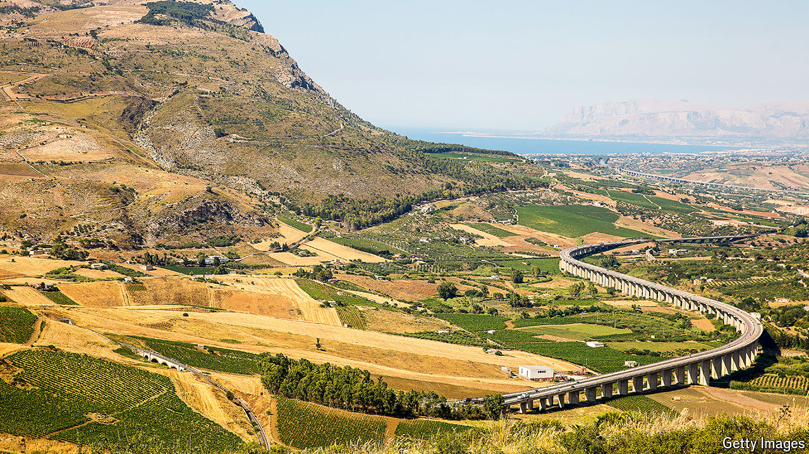

###### The cash flows south

# How Italy’s Mezzogiorno is benefiting from a flood of EU aid 

##### It can’t spend it fast enough 

 

> Aug 22nd 2024 

Aldo Altomonte sensed that something was wrong. The man claiming to be a postman and asking to be let in said that he had Mr Altomonte’s renewed driving licence. But Mr Altomonte had applied for it only three days before. And in Italy—let alone in Reggio Calabria, the main city of Italy’s poorest region, Calabria—nothing bureaucratic ever happens in three days. It took a neighbour who knew the postman to convince the elderly Mr Altomonte that it was all true.

