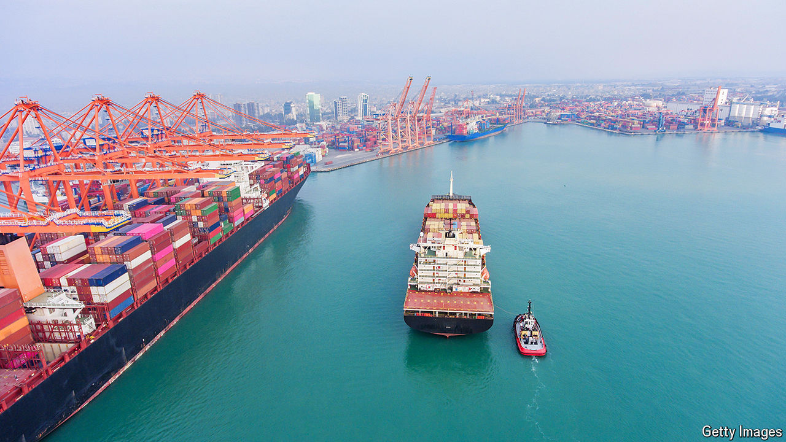

###### The Russian economy

# The mysterious middlemen helping Russia’s war machine 

##### Sanctions are as watertight as a sieve 

 

> Aug 19th 2024 

RUSSIA IS PLANNING for decades of , a senior foreign-ministry official, Dmitry Birichevsky, said last week. The evidence suggests that might not be too much of a problem. The economy is , at an annualised rate of 4% in the second quarter, after a whopping 5.4% the quarter before, despite one of the toughest regimes ever imposed. Trade continues to flourish. How come?

