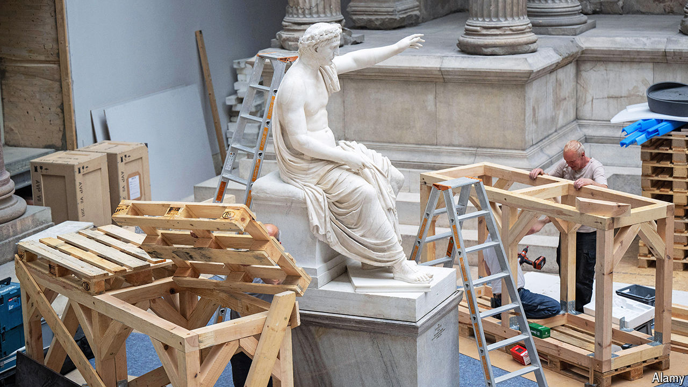

###### Not very Teutonic

# The rebuilding of Berlin’s Pergamon Museum is 40 years behind schedule 

##### It’s yet another German construction debacle 

 

> Aug 22nd 2024 

Almost 25 years ago, in October 1999, Gerhard Schröder, Germany’s then chancellor, attended a ceremony to mark the renovation of Berlin’s Old National Gallery, one of five world-class museums that constitute the  (Museum Island) in Berlin. Mr Schröder talked about the courage and vision needed to rebuild the rest of the quintet within ten years. “We will manage this,” he promised.

