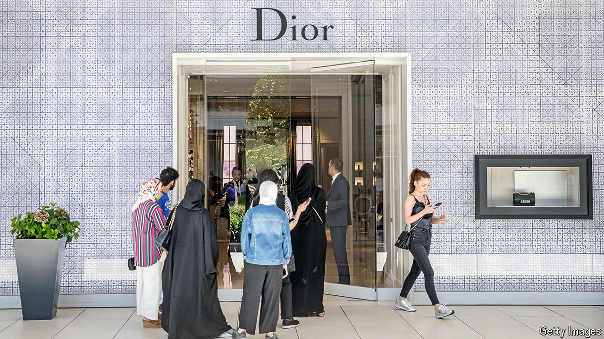

###### Gold rush

# Turkey’s asset-price boom is good for some but terrible for most 

##### The rich are getting richer 

 

> Aug 22nd 2024 

On a weekday afternoon the boutiques of Istanbul’s Istinye Park shopping centre are elegantly buzzing. The city’s Michelin-starred restaurants are booked out for months, and the yacht marinas are full. Signs of an astounding wealth boom are everywhere in Turkey’s biggest city, as the consumption of luxury goods surges. The rich are getting richer: the number of ultra-high net worth individuals (those with a value of $30m or more) in Turkey rose by 10% between 2022 and 2023. Yet ask the average Turk whether they feel they are getting wealthier, and the answer will almost certainly be no. 

