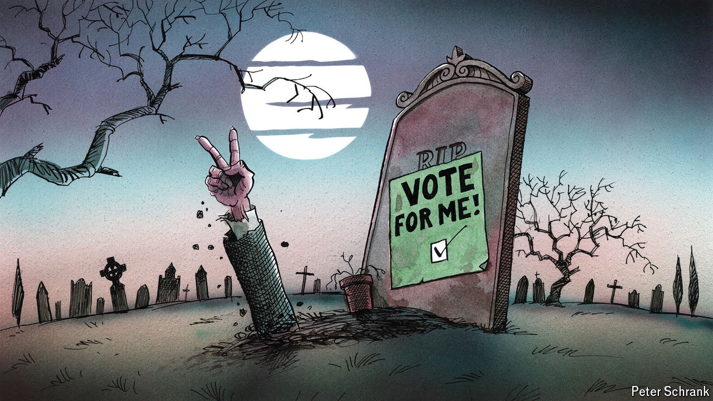

###### Charlemagne

# What Europe’s comeback politicians can teach American voters 

##### A second shot at power can mean too much of the same 

 

> Aug 22nd 2024 

All political careers end in failure, but some politicos decide to ignore the memo. In Europe a caste of national leaders booted out of office have made their names by eschewing retirement and returning for a second (or third) stint in power. Such encores seem to defy electoral logic: why would voters plump for a candidate they had previously sent packing? A phenomenon that could once be dismissed as a mere European electoral curio may hold lessons for American voters as they ponder whether to send one former White House resident back to his old haunts. Alas, looking at what some of Europe’s returnees have wrought will do little to soothe those who fret that a second coming of Donald Trump might make the first one seem like a time of wise and moderate governance. The track record of rebooted politicians is not all grim. But a fresh shot at power offers unwelcome opportunities for boomeranging rulers to subvert the system.

