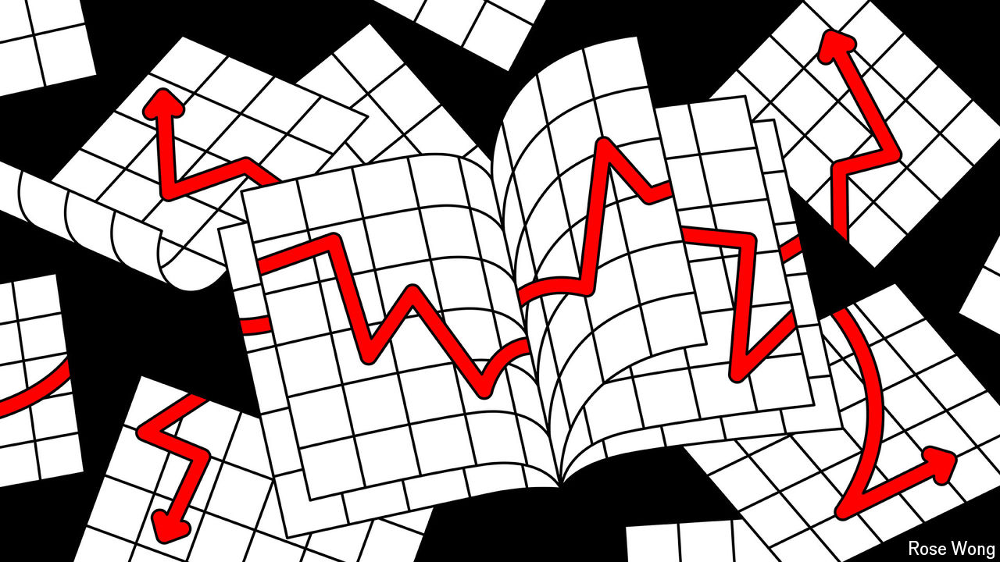

###### Danger signs

# Is America already in recession? 

##### Some rules of thumb suggest so 

 

> Aug 22nd 2024 

An early-warning system for recessions would be worth trillions of dollars. Governments could dole out stimulus at just the right time; investors could turn a nice profit. Unfortunately, the process for calling a recession is too slow to be useful. America’s arbiter, the National Bureau of Economic Research, can take months to decide. Other countries simply look at gdp data, which emerge with a lag. 

