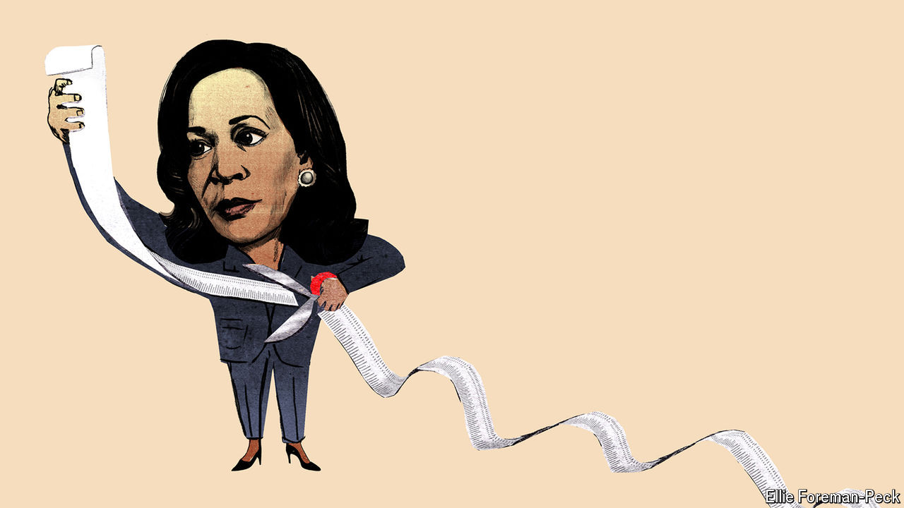

###### Muddled and misguided

# Kamala Harris’s cost-of-living plan will end in failure 

##### She is the latest presidential candidate to embrace self-defeating economics 

 

> Aug 20th 2024 

It is easy enough to understand what is motivating Kamala Harris’s economic strategy. Poll after poll demonstrates that many Americans consider the cost of living to be their  heading towards the presidential election in November, and Ms Harris is , having served as vice-president during a time when inflation soared to a four-decade high. Rather than gloss over this ugly reality, she is trying to confront it. “Lower costs for American families” is the centrepiece of her economic agenda, a message she is likely to deliver again on August 22nd, after we go to press, in a speech to the Democratic National Convention.

