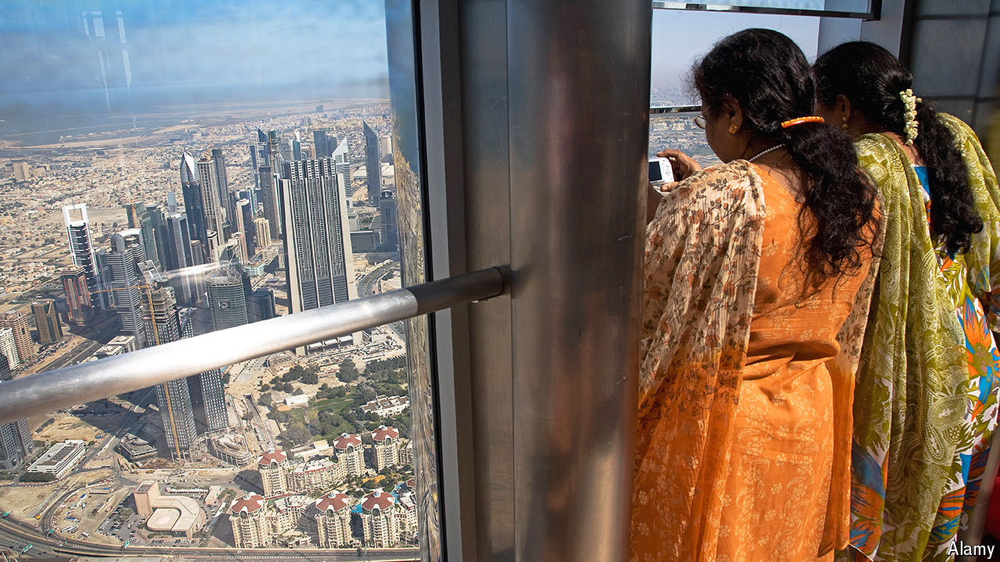

###### From Bangkok to Dubai

# Indian tourists are conquering the world 

##### A booming middle class, budget flights and Bollywood 

 

> Aug 20th 2024 

INDIAN EXPRESS on a Friday evening is always bustling. Diners from all corners of India dig in to kebabs and curries. Kingfisher, an Indian lager, flows freely, and Bollywood music blares from the speakers. A similar (if slightly more abstemious) scene plays out down the road at Radha Krishna, a vegetarian eatery. One might be in any of a dozen cities in India. But this paratha party is happening in Bangkok.

