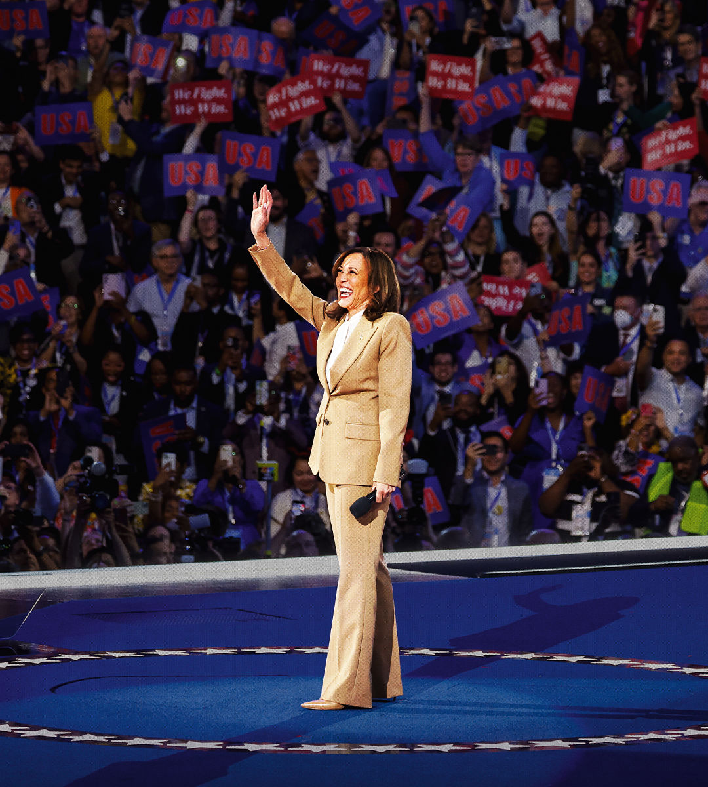

###### Personality and policy

# Kamala Harris can beat Donald Trump. But how would she govern? 

##### Being a politician is about more than campaigning. More policy detail is needed 

 

> Aug 22nd 2024 

A few weeks ago the Democratic convention looked as if it would be a wake. Instead it has been a love-in. Delegates’ ebullience has been spiced with relief that their nominee has saved the party from almost-certain defeat.

