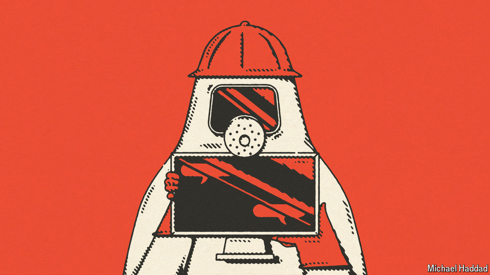

###### Artificial intelligence

# Regulators are focusing on real AI risks over theoretical ones. Good 

##### Rules on safety may one day be needed. But not yet 

 

> Aug 22nd 2024 

“I’m sorry Dave, I’m afraid I can’t do that.” HAL 9000, the murderous computer in “2001: A Space Odyssey” is one of many examples in science fiction of an artificial intelligence (AI) that outwits its human creators with deadly consequences. Recent progress in AI, notably the release of ChatGPT, has pushed the question of “existential risk” up the international agenda. In March 2023 a host of tech luminaries, including Elon Musk, called for a pause of at least six months in the development of AI over safety concerns. At an AI-safety summit in Britain last autumn, politicians and boffins discussed how best to regulate this potentially dangerous technology.

