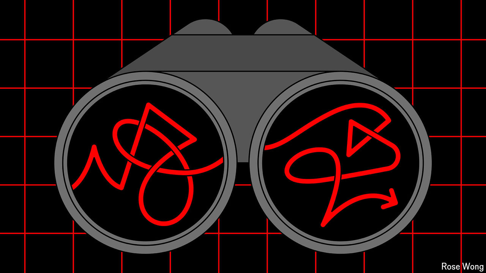

###### Recession scares

# What to make of America’s topsy-turvy economy 

##### Don’t panic just yet 

 

> Aug 22nd 2024 

Don’t blame American investors for feeling seasick. The past few weeks have brought a swirl of contradictory economic news: stock prices  and then rebounded; jobs figures were weaker than predicted but retail sales were much stronger. Chatter about an immediate emergency interest-rate cut by the Federal Reserve built up and then died down. After the exuberance of the first half of 2024, economy-watchers are anxiously poring over each new data release. The utterances of Jerome Powell, the Fed’s chairman, at the Jackson Hole  on August 23rd, after we published this, will be examined even more closely than usual. 

