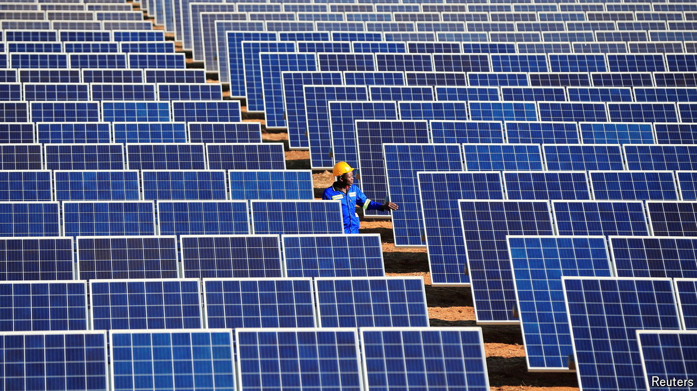

###### The sun also rises

# A shift towards green investment is under way in Africa 

##### Green deals represent almost half of all venture-capital activity in the continent 

 

> Aug 22nd 2024 

Over the past few years there has been a sharp slowdown in venture-capital funding worldwide. Africa is less than 5% of the global market by deal value but has proved to be relatively insulated; total deal value peaked later, at $6.5bn in 2022, and fell less sharply, to reach $4.5bn in 2023. Make no mistake, the environment is challenging: steep currency devaluations and high inflation in some countries have dissuaded skittish investors from writing cheques and led some to leave the continent altogether. Yet there is good news, too. The industry is adapting. A financial squeeze is forcing startup founders to make tough choices in the name of efficiency: consolidating with rivals and cutting costs to hit profitability targets faster. Agility is the name of the game. Perhaps reflecting this, recent figures for funds raised by startups have improved: July was the best month in over a year.

