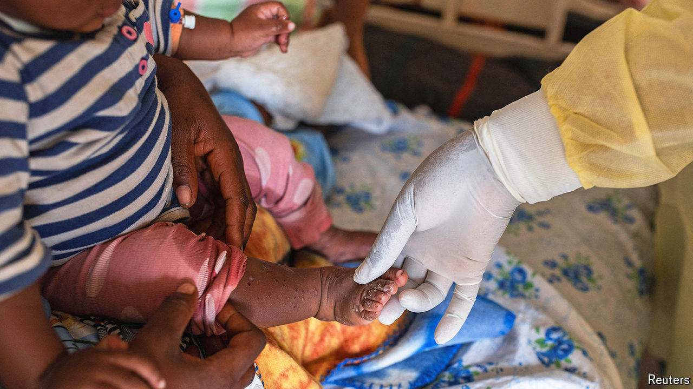

###### A new epidemic

# In Congo, a desperate struggle to control the deadly mpox outbreak 

##### A rush to isolate the disease and vaccinate people is under way 

 

> Aug 21st 2024 

On august 14th mpox was declared “a public health emergency of international concern” by the World Health Organisation. In eastern Democratic Republic of Congo, the centre of the crisis, fear is widespread. “We did not flee the war at home to die with this disease here,” says 29-year-old Jean Munguiko, a refugee in a camp near Goma. A new and probably  was discovered 500km away in South Kivu, where a . The disease has been found widely across Congo and beyond. Infected sex workers cross into neighbouring countries. In the camps families are spreading it by sharing washcloths and utensils. Aid workers are repurposing Ebola and covid-19 treatment centres into makeshift isolation sites.

