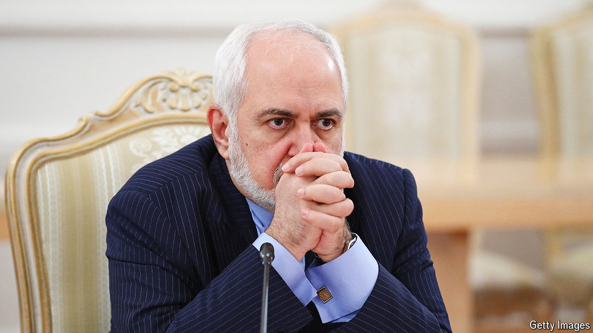

###### Iran’s new government

# The threat of war is empowering the Islamic republic’s hardliners 

##### As a result, Iran’s new president is off to a disappointing start 

 

> Aug 22nd 2024 

“Ishouldn’t have voted,” says one unveiled Iranian woman. After a burst of enthusiastic voting in the second round of Iran’s recent presidential election, popular disillusionment has returned. Despondency is back at the top, too. Javad Zarif (pictured), Iran’s former foreign minister and its new vice-president, resigned on August 11th. He ran Masoud Pezeshkian’s campaign and helped revive hopes of a more representative government. The announcement of the new cabinet on August 21st showed how those hopes have been dashed.

