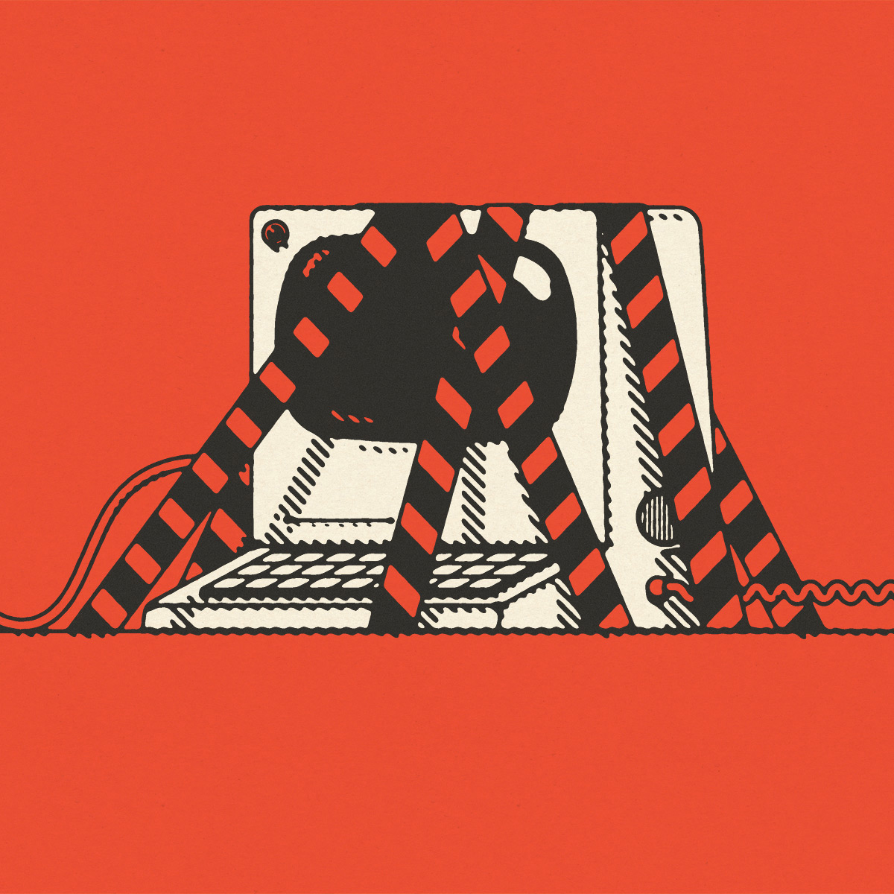

###### Risks and rules

# AI needs regulation, but what kind, and how much? 

##### Different countries are taking different approaches to regulating artificial intelligence 

 

> Aug 20th 2024 

For decades, the field of artificial intelligence (AI) was a laughing stock. It was mocked because, despite its grand promises, progress was so slow. The tables have turned. Advances in the past decade have prompted a growing concern that progress in the field is now dangerously rapid—and that something needs to be done about it. Yet there is no consensus on what should be regulated, how or by whom. What exactly are the risks posed by artificial intelligence, and how should policymakers respond?

