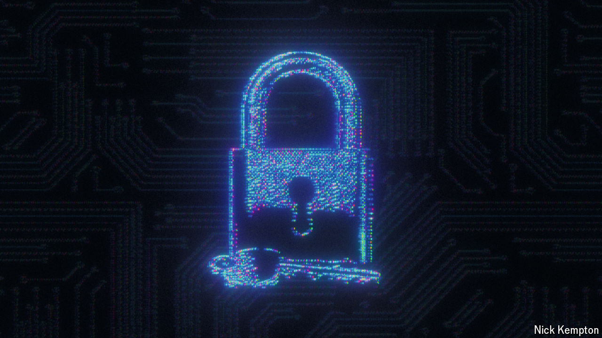

###### Cryptography

# The world needs codes quantum computers can’t break 

##### America’s standards agency thinks it has identified three 

 

> Aug 21st 2024 

QUANTUM COMPUTERS, which exploit strange properties of the subatomic realm to crunch numbers in powerful new ways, do not actually work yet. But if and when they do start working, they will be able to break the cryptographic algorithms that currently protect online communications, financial transactions, medical records and corporate secrets. 

