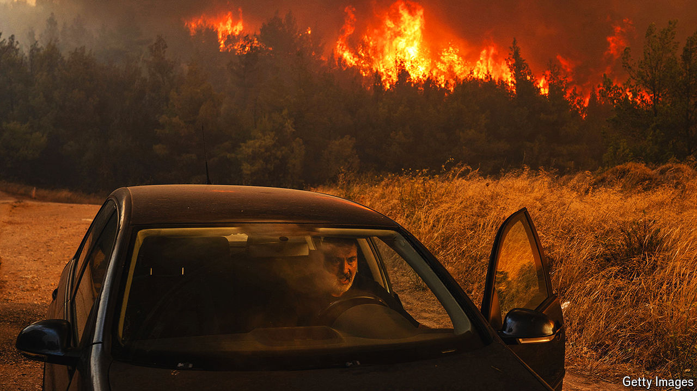

###### Red planet

# Wildfires are getting more frequent and more devastating 

##### Climate change is accelerating the blaze 

 

> Aug 22nd 2024 

HUMANITY HAS lived and played with fire for at least 300,000 years. The oldest hearth, discovered at Qesem Cave in Israel and thick with wood ash, is as old as . Burning never subsequently went out of fashion. Millennia later, the large-scale combustion of coal, oil and natural gas unlocked energy on a scale far beyond the hearth—and in so doing set in train profound changes to the planet’s climate. Humankind, activists are fond of saying, set fossil fuels alight and the world with it. They brandish placards with images of a burning blue marble. 

