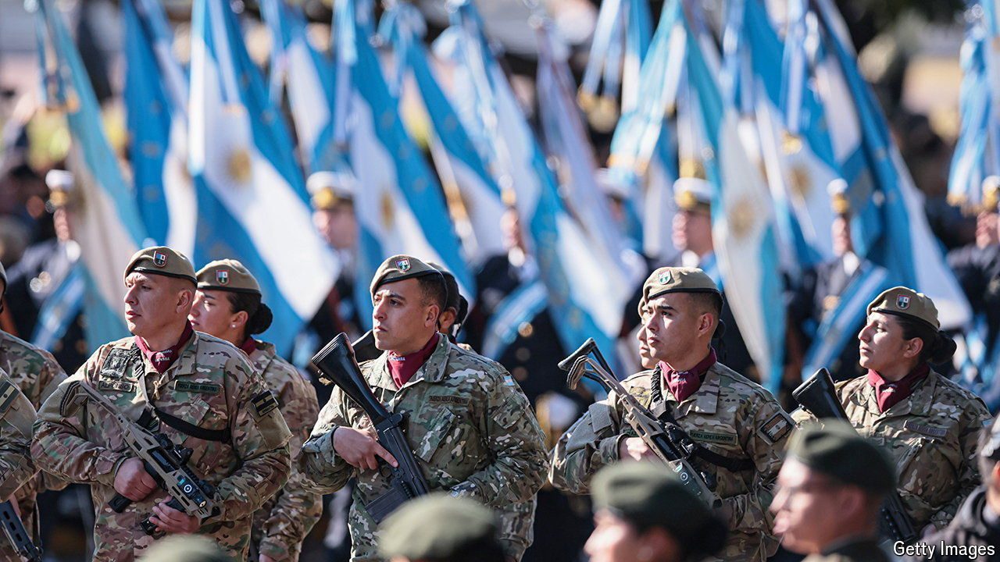

###### Military Mileise

# Javier Milei is splurging on the army 

##### Many Argentines are asking why 

 

> Aug 22nd 2024 

Self-proclaimed anarcho-capitalists ought to be sceptical of large standing armies. President Javier Milei of Argentina seems to relish them. Even as he tightens the government purse, he has committed to raising defence spending from 0.5% of GDP to 2% over the next eight years. He vows to “restore the prestige” of the army and transform it into a hi-tech force. 

