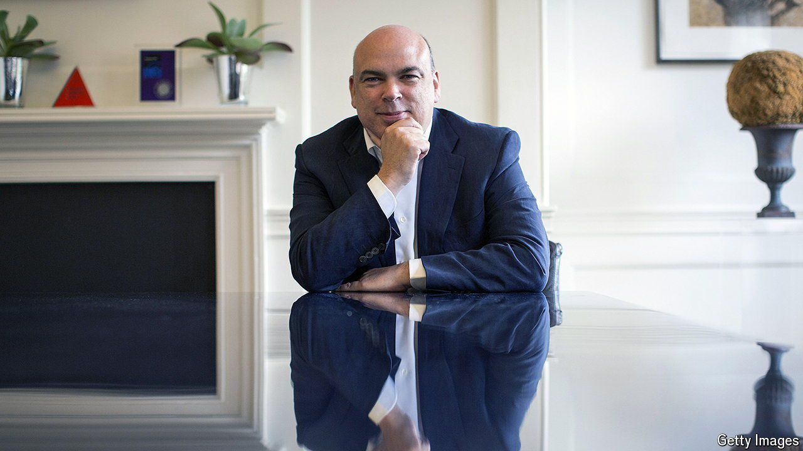

###### The world this week

# Business 

#####  

 

> Aug 22nd 2024 

 was among several people who died or are missing after a luxury yacht sank in bad weather off the coast of Sicily. In June Mr Lynch, the former chief executive of Autonomy, a British software firm, was found not guilty by a jury in San Francisco of defrauding Hewlett-Packard in relation to its takeover of Autonomy in 2011. The long-running legal saga had not finished; a British judge was considering damages Mr Lynch should pay in a separate civil trial. In an eerie coincidence, Stephen Chamberlain, Mr Lynch’s co-defendant, who was also found not guilty in June, was hit by a car and died shortly before the boating incident. 

